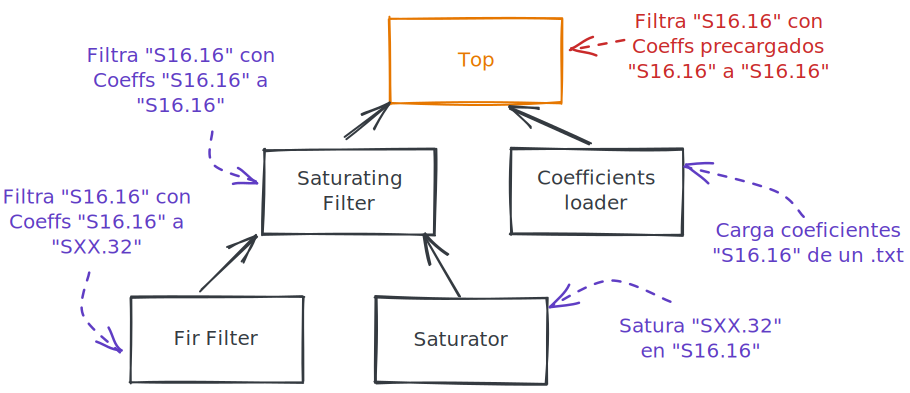

# VHDL-Pipelined-Fir

VHDL Pipelined Fir implementation for S16.16 operands and saturation/rounding. 

[Orsi, Lucas](https://github.com/lorsi96) 
[Alvarado Moreno, José David](https://github.com/jdalvaradocol) 

 

## Description
The Filter implemented in this repository features:
- S16.16 operands (input, output, coefficients).
- Saturation and Rounding **only** at output stage.
- Supports up to 60 coefficients.
- Testbenchs in Python using CocoTb

## Implemented FIR Architecture

## VHDL Modules Architecture

Project based on [Parallel FIR Filter](https://github.com/DHMarinov/Parallel-FIR-Filter) 