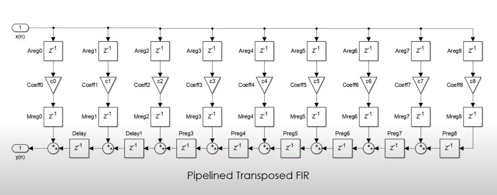

# VHDL-Pipelined-Fir

## Decription
VHDL Pipelined Fir implementation with the following features:
- S16.16 operands (input, output, coefficients).
- Saturation and Rounding **only** at output stage.
- Supports up to 60 coefficients.
- Testbenchs in Python using CocoTb

## General architecture
